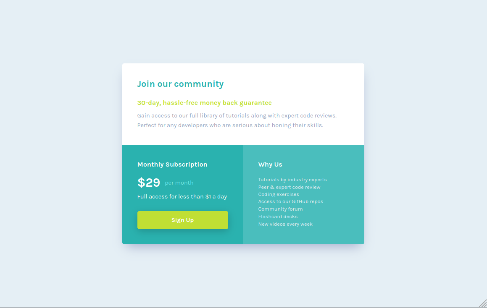

# Frontend Mentor - Single price grid component solution

This is a solution to the [Single price grid component challenge on Frontend Mentor](https://www.frontendmentor.io/challenges/single-price-grid-component-5ce41129d0ff452fec5abbbc). Frontend Mentor challenges help you improve your coding skills by building realistic projects.

## Table of contents

- [Overview](#overview)
  - [The challenge](#the-challenge)
  - [Screenshot](#screenshot)
  - [Links](#links)
- [My process](#my-process)
  - [Built with](#built-with)
  - [What I learned](#what-i-learned)
  - [Continued development](#continued-development)
  - [Useful resources](#useful-resources)
- [Author](#author)
- [Acknowledgments](#acknowledgments)

## Overview

### The challenge

Users should be able to:

- View the optimal layout for the component depending on their device's screen size
- See a hover state on desktop for the Sign Up call-to-action

### Screenshot

### Links

- Solution URL: [GitHub](https://github.com/marisudris/frontend-mentor-single-price-grid-component)
- Live Site URL: [GitHub Pages](https://marisudris.github.io/frontend-mentor-single-price-grid-component/)

## My process

1. Coming up with accessible & semantic HTML structure that provides hooks for styling.
2. Development of mobile macro layout.
3. Micro layout for the small details like pricing, body text line heights etc.
4. Development of desktop macro layout.
5. Adjusting details & spacing as necessary

### Built with

- Semantic HTML5 markup
- CSS custom properties
- Flexbox
- CSS Grid
- Mobile-first workflow

### What I learned

Coming up with proper HTML structure pays off and saves some development time later. Looking at both mobile **and** desktop design is crucial for determining the best structure for responsive styling.

## Author

- Frontend Mentor - [@marisudris](https://www.frontendmentor.io/profile/marisudris)
- GitHub - [@marisudris](https://www.github.com/marisudris)